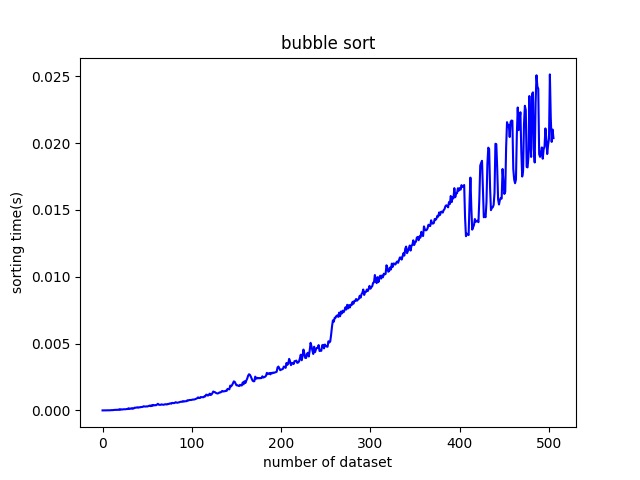

# sortingAnalysis

## 특징
* 각각의 sorting 알고리즘을 처리 시간, 반복 횟수로 비교
* 선택 정렬, 삽입 정렬, 버블 정렬, 합병 정렬, 퀵 정렬

## 파일 설명
* sorting.py : main python 파일
* boston.csv : 정렬에 사용되는 데이터셋
* timeGraph.png : 시간 기준 비교
* countGraph.png : 반복 횟수 기준 비교 

## 그래프

## 진행상황
2019.11.22 : 버블 정렬 구현
